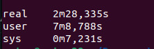

# INFORME PARADIGMAS LAB 03 

/------------------------------------------------------------------/

# SOBRE SPARK:

/------------------------------------------------------------------/

La adaptación del lab 02 al lab 03 se da principalmente con el agregado de la clase Spark en el archivo Spark.java
dentro del directorio utils.
La clase contiene un método SparkSession que computa las entidades y luego las imprime cuyo prototipo es:

public static void SparkSession(Heuristics heuristica, String formato_de_impresion, String path, String pathJSON, List<Article> articulos)

El método toma una heurísitica a través de la cual se indica que datos se deben buscar en los artículos. Formato_de_impresion se refiere al tipo de impresión de estadísticas. El formato indica si se van a imprimir las estadísticas por categoría o por tópico.  Una ruta a un archivo de texto (que puede ser null o no dependiendo desde que lugar se quieran computar las entidades), la ruta al archivo JSON y por último la lista de artículos.

Lo primero es iniciar una sesión de spark:

SparkSession spark = SparkSession
		.builder()
		.appName("Nombre_de_la_aplicacion")
		.getOrCreate();
		
Así podemos comenzar a utilizar las funcionalidades con datos distribuidos. Una vez hecho esto, ya podemos pasar 
nuestro contenido a un formato dataframe de spark para poder manipularlos en paralelo (RDD).

De esta forma transformamos objetos o grandes cantidades de datos a una colección de elementos que se pueden procesar en paralelo.
Luego de esto ya estamos aptos para justamente procesar estos datos de una forma más eficiente, debido a que dividimos la carga
del procesamiento. La arquitectura de spark se define por clusters, en donde un cluster está definido por un master y workers.
El master viene a representar a la aplicación en si, siendo este el encargado de distribuir las tareas a los distintos workers
que las ejecutan en paralelo, obteniendo así una utilización de los recursos más eficiente.

/------------------------------------------------------------------/

# PASOS NECESARIOS PARA EJECUTAR EL PROGRAMA:

/------------------------------------------------------------------/
Sea APP_HOME el directorio donde está este archivo README.md

$cd $APP_HOME
$mvn install
$mvn clean package

Eso descarga las dependencias que necesitamos y crea el directorio target donde queda el jar que nos interesa.

Como usarlo:

Definir la variable de entorno APP_PATH como la ruta al directorio APP_HOME: 'export APP_PATH=<APP_HOME>' (IMPORTANTE)

En el directorio $SPARK_HOME pueden usar bin/spark-submit:

$ bin/spark-submit  --master local[2] $APP_HOME/target/App-0.1.jar  -flags

Si no quieren ver la información de spark pueden redirigir stderr a /dev/null:

$ bin/spark-submit  --master local[2] $APP_HOME/target/App-0.1.jar  -flags 2>/dev/null

donde flags funcionan de la misma manera que el laboratorio anterior con la particularidad de que 
eliminamos -f y agregamos -ph la cual si es distinta de null computaremos las entidades nombradas
del archivo dado por ese path y si es null computaremos las de todos los articulos del feeds.json.

/------------------------------------------------------------------/

# CAMBIOS QUE TUVIMOS QUE HACER

/------------------------------------------------------------------/
Importar las librerias necesarias con las estructuras de datos y operaciones que proporciona spark.

Hacer que tanto clases como interfaces que se usen en operaciones distribuidas implementen/extiendan de la interfaz Serializable.

Eliminamos la flag -f ya que al ejecutar Spark en un archivo con pocas lineas tarda mas que si solo
lo computaramos con el lab2. Esto sucede debido a la sobrecarga inicial y a las operaciones de configuracion 
que ocurren entre que se inicia la session de Spark y luego cuando el master distribuye y coordina las tareas con todos los nodos.

Al principio intentamos aplicar nuestro método ClasificarCandidatos al resultado de aplicar la heurística a 
todo el texto que le pasemos por parámetro (de forma distribuida con RDDs).
Tuvimos varios problemas ya que esto tardaba demasiado para archivos chicos y a veces ocurrian situaciones
inesperadas.
Luego analizando más en detalle el código, nos dimos cuenta que esto era inescalable para archivos medianos y grandes
ya que para cada String(candidato) se tenia que guardar TODO el dictionaryJSON en una variable (además se tenía que comparar
con una lista de entidades para saber si ya existía), provocando que sea altamente costoso en terminos de computo.
Luego pudimos deducir de que solo debiamos leer el JSON una sola vez y que esta informacion llegue a todos los nodos
del cluster.
Esto lo hacemos con una variable broadcast, lo que permite que cada nodo del cluster obtenga el Json de manera eficiente
y no se tenga que cargar por cada vez que clasifiquemos entidades, ya que estos se cargan de manera local en cada uno. Probamos
implementar esta idea primero instanciando un objeto JSONArray tal cual como lo hacíamos en ClasificarCandidatos del lab2 para
poder crear la variable broadcast a partir del mismo, pero nos encontramos con que JSONArray no es serializable. En consecuencia,
buscamos crear una nueva clase que represente el diccionario (JSON.java) para poder usarlo como broadcast. 
Junto a este cambio, tambien cambiamos la forma de computar entidades. En vez de trabajar con listas (más complejo), vamos 
creando entidades de a una a partir de cada candidato comparando con el diccionario. De esta forma, ignoramos los candidatos 
que no coincidan  con ninguna entidad del diccionario, reduciendo la categoría other (para más eficiencia). 
En consecuencia de lo dicho anteriormente eliminamos la clase ComputeNamedEntities, ya que no usamos los métodos de clasificar 
y pensamos que el método CrearEntidad debería ir en la clase de Entidad Nombrada. También cabe aclarar que la heurística que 
extrae candidatos a partir del diccionario ya no tendría sentido, pero igualmente si probamos usarla tarda muchísimo debido 
a que justamente usa un JSONArray.

/------------------------------------------------------------------/

# Desempeño sobre archivos

/------------------------------------------------------------------/

Las imágenes las dejamos adjuntas en el repositorio.

